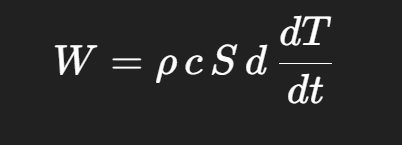
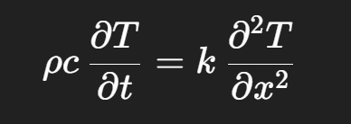
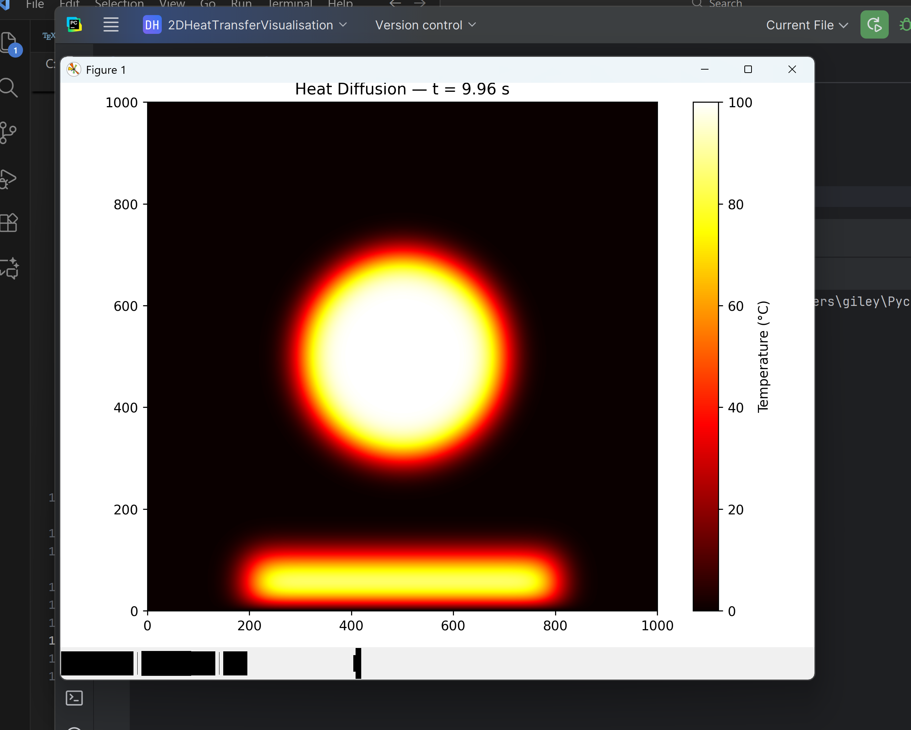
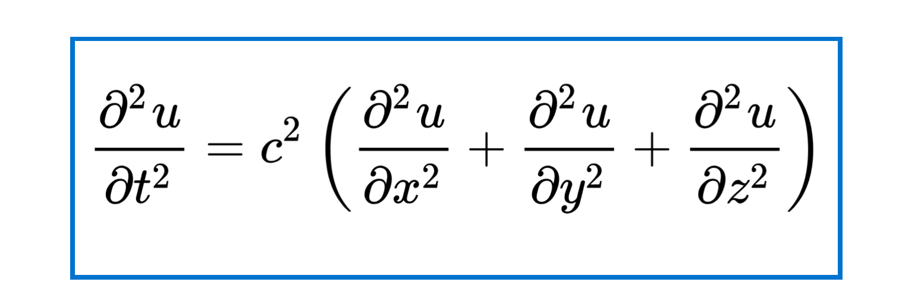
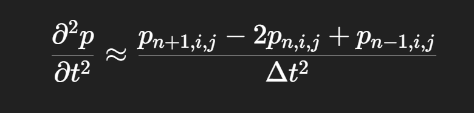
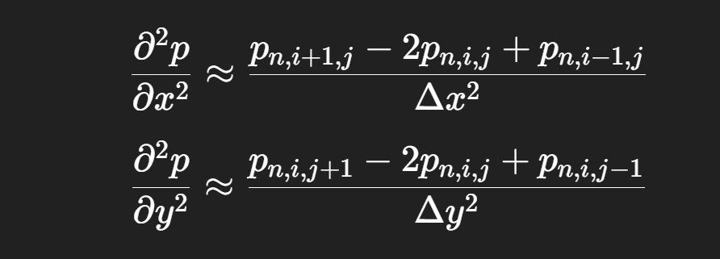
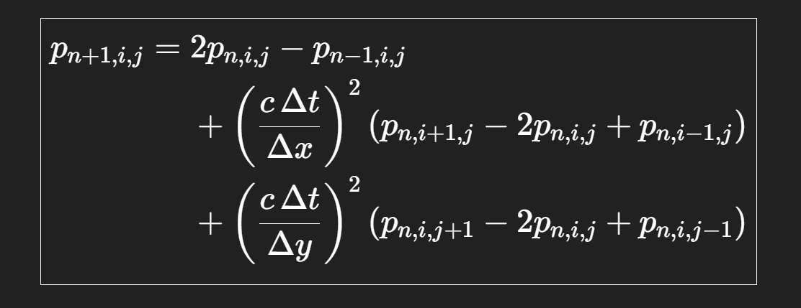
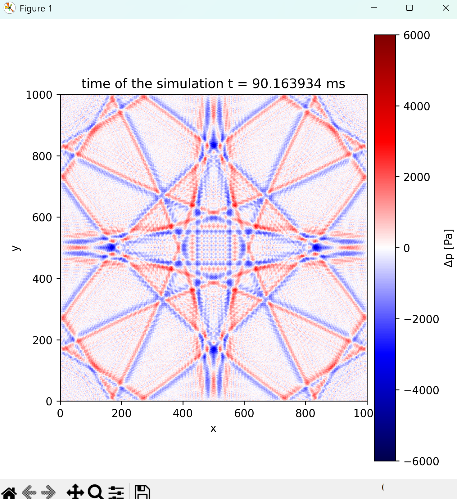

# 2DHeatTransfer
2D Heat Transfer using OpenMP and some of Bentley’s rules for optimisation

Introduction:

This task was created mostly to learn optinisation on the real project, but it is also pretty beautiful

I hope to extend it to 3D and, perhaps return to it later to use the GPU instead of the CPU. But right now it gives quit good speed (nearly 4 GFlOP per second)

So lets begin with the core logic:

1 Physics base 

To derive the main differential equation, we start from Fourier’s law of heat conduction.

It is written in the following form:

But we can revrite this in this form:

To account for the thermal energy stored in the material, the heat flow 
𝑊
W is expressed using the specific heat capacity: 

We take the derivative from both sides to get our main differential equation

we then replace k / (ρ c) with α, the thermal diffusivity coefficient 

2. Mathematical base: 

We use the finite difference method, so we can basically rewrite the differential equation as a discrete approximation over a grid of points.
Instead of working with continuous derivatives, we replace them with difference quotients between neighboring grid values. For example, the second derivative in the x-direction can be approximated as

Using these approximations, the 2D heat equation turns into an algebraic update rule that lets us compute the temperature of each grid cell based on the values of its neighbors.

3. Core logic 

So we basically seting the coeficient before differential equation, time, time step (each step we will upload the temperatures), size of the grid, step for the x and y (the grid is square so it is the same dh = dx = dy), and coefitiet, which is equual to the alpha * dt/dh * dh - he is used in the loop 

I have 3 nested loops 
1  for time 
1 for x cordinate 
1 for y coordinate 

I just use the finite difference formula to compute the new temperature of the cell based on the temperature of its neighbors 
Save it to the dynamic array and swap 2 arrays each time (Tnew array is just buffer)
Before optimisation, the simulation was running for more than 840 seconds.

Using the following steps, I reduced the execution time to just 16 seconds (on a Ryzen 9 AI HX – 12 cores / 24 threads).

Tiling:
In order to reduce the amount of cache operations, I divided the grid into 4 × 4 small matrices. The actual tile size should be selected based on the problem and the CPU architecture. In my case, 4 × 4 gave the best performance.

Parallelism:
I used the OpenMP library to utilize all available threads in the outer loops.

Note: I did not encounter data races because I used a separate buffer (T_new) instead of updating T directly.

Vectorisation:
I enabled vectorisation of operations (since the computations are relatively simple) to reduce unnecessary memory accesses and improve throughput.

Long dynamic array instead of a matrix:
In such projects, a 2D matrix can significantly hurt performance, because memory addresses for each row may not be stored contiguously in memory. This leads to poor cache usage.

Instead, I used one long, dynamically allocated array, where the memory is stored linearly under a single address. I accessed elements using

array[i*N + j]

instead of

array[i][j]

which significantly improved memory locality and overall performance.

Also, I have used the .bin files instead of the CSV because CSV takes too much space -> so it iis longer to store them and create visualisation + we have to conver the float to the text, which takes a lot of time 

I have also deciided to switch to float, since I use less cache and do not need so good precision as double (I show only 3 symbols after the comma)

5. Visualisation (Python)

For visualisation of the simulation results, I used Python with NumPy and Matplotlib.

All simulation frames were saved as binary files (.bin) in the output directory. Using the glob and natsort libraries, I loaded the frames in the correct order. Each file was read using np.fromfile() and reshaped into a 1000 × 1000 grid representing the temperature field at a given time step.

To display the data, I used matplotlib.pyplot.imshow() with a hot colormap, where colors correspond to temperature values. The animation was created using FuncAnimation, updating the image for each new frame and displaying the current time in the title.

This approach allowed me to observe the heat diffusion process over time in a dynamic and clear way, making it easier to analyze both the physical behavior and the numerical stability of the model.

It looks like this 

2D wave propagation simulation using the finite difference method.
C++ is used for high-performance computation and parallelism, while Python is used for visualization.

Introduction
This project implements a 2D wave propagation simulation based on the classical wave equation.
The numerical solver is written in C++ and optimized using OpenMP and several well-known performance optimization principles (including cache-aware design and data locality considerations inspired by Bentley’s rules).
Simulation results are visualized using Python with NumPy and Matplotlib.

1. Physics base:
    The simulation is based on the standard 2D wave equation:
    
where:
u is the pressure (or displacement) field,
c is a constant representing the wave propagation speed (e.g. speed of sound).

2. math base:
To solve the wave equation numerically, the finite difference method is used.
Second-order central differences are applied:

in time for the second time derivative,
in space for both spatial derivatives.
    
    

Finally, I get this equation, ready for calculations:

This transforms the partial differential equation into an explicit algebraic update rule, allowing the pressure value at each grid point to be computed from its neighbors and from the previous time steps.

The final update equation is fully explicit and suitable for efficient numerical implementation.

Using this approximation, the continuous PDE is reduced to a set of simple arithmetic operations performed on a discrete grid.

3. Core logic 
All physical and numerical constants are defined in a header file inside a constants namespace.
The most important parameters include:

    time step dt,

    spatial step dh (with dx = dy = dh),

    wave speed c,

    coefficients (c dt/dh)^2 used directly in the update formula.

The simulation is implemented using three nested loops:

    an outer loop over time steps,

    two inner loops over the spatial coordinates (i, j).

With tiling enabled, the spatial loops are further subdivided into smaller blocks.

At selected time steps, the current pressure field is written to disk as a binary .bin file.
Binary output is used instead of CSV because:

    it significantly reduces file size,

    it avoids expensive float-to-text conversions,

    it speeds up both I/O and post-processing.

These files are intended only for Python visualization, not for human inspection.

4. Optimisation methods 
Several optimization techniques were applied, reducing the total runtime from over 840 seconds to about 6 seconds on a Ryzen 9 AI HX (12 cores / 24 threads).

1. Parallelism (OpenMP) 
    OpenMP is used to parallelize the outer loops.
    Data races are avoided by using a separate buffer for the next time step instead of updating the grid in place.
2. Tiling (Blocking)
    The grid is divided into small tiles to improve cache locality and reduce memory traffic.
3. Vectorization
    The computation is structured to allow the compiler to automatically vectorize inner loops, improving throughput.
4. 1D Array Instead of 2D Matrix
    Instead of a 2D array, a single contiguous 1D array is used:
    array[i * N + j]
    This improves memory locality and cache efficiency compared to traditional array[i][j] layouts.
5. Single Precision (float)
    Single-precision floats are used instead of doubles to reduce memory usage and cache pressure.

    Higher precision is unnecessary since only a limited numerical accuracy is required for visualization.

5. Visualisation 
Simulation results are visualized using Python, NumPy, and Matplotlib.

Each time step is stored as a binary (.bin) file containing the pressure field in single-precision format. Files are loaded in correct temporal order using glob and natsort, then read with numpy.fromfile() and reshaped into a 1000 × 1000 grid.

For visualization, the reference pressure p0
is subtracted to display pressure deviations. The field is rendered using imshow() with a seismic diverging colormap, which clearly highlights positive and negative wave amplitudes.

The animation is created with FuncAnimation, updating both the pressure field and the displayed simulation time. This setup allows clear observation of wave propagation and interference patterns with minimal post-processing overhead.

